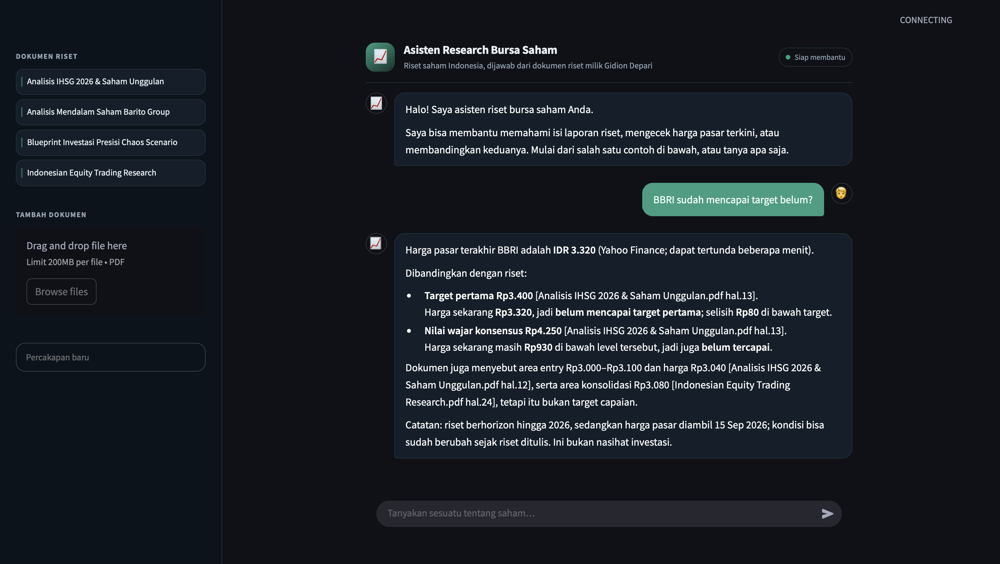
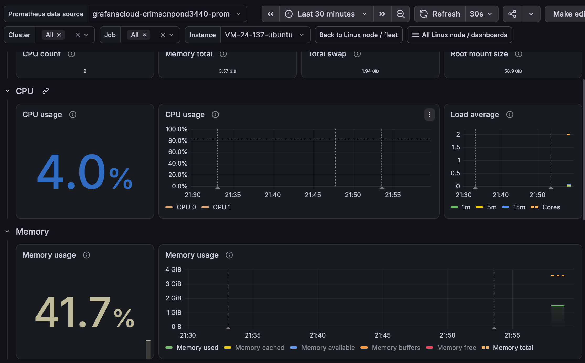
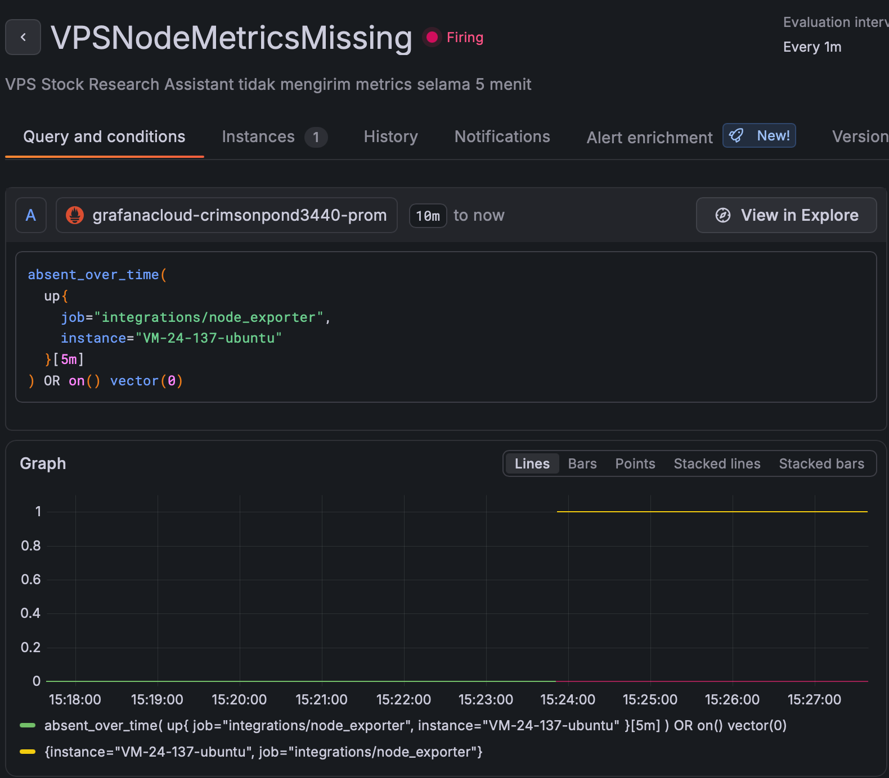
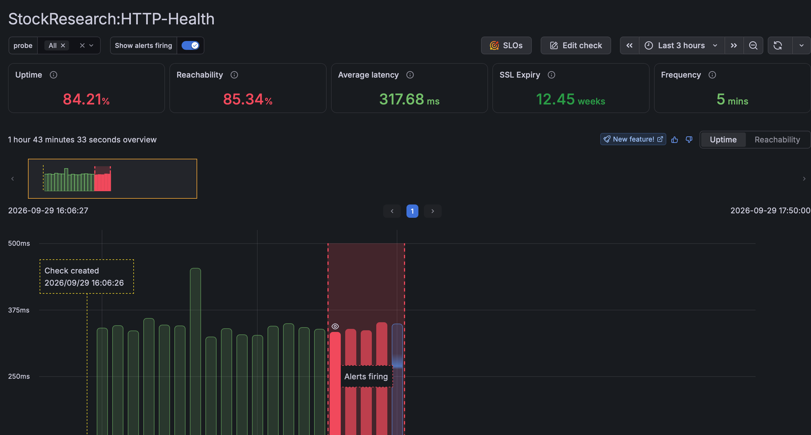
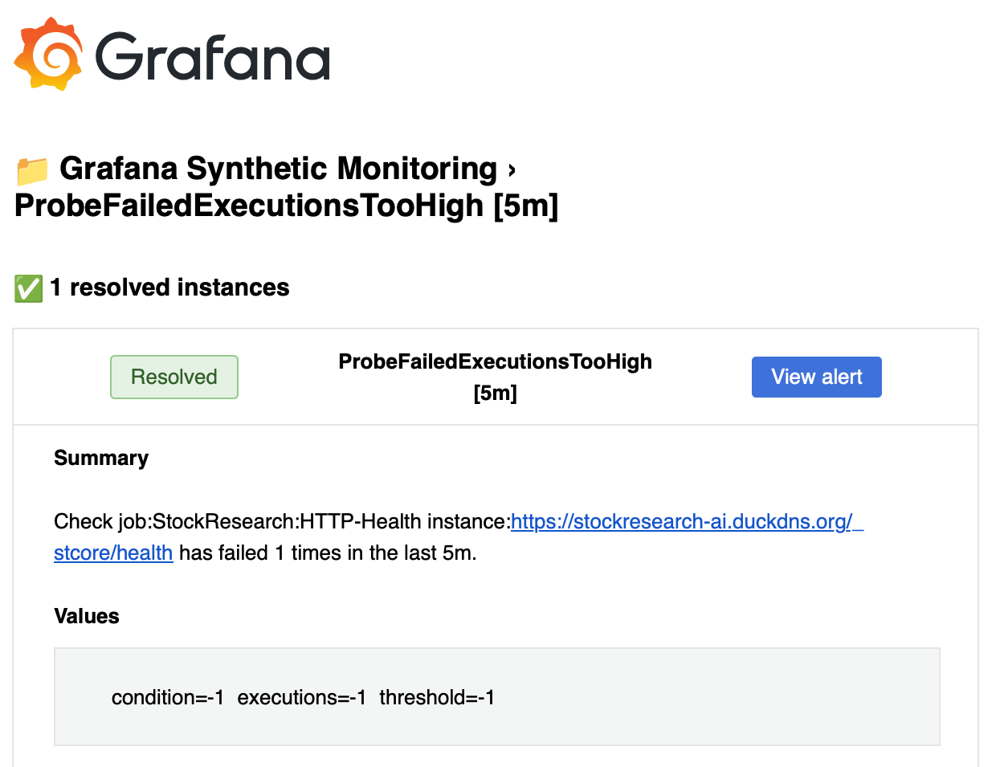
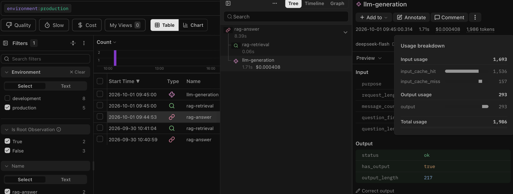

# Stock Research Assistant

**Name:** Gidion Depari · **LinkedIn:** [linkedin.com/in/gidion2](https://www.linkedin.com/in/gidion2)



**RAG chatbot for Indonesian stock research.** It answers questions using Gidion's personal collection of research documents, cites file names and page numbers, retrieves market prices only when a question actually requires them, and calculates profit/loss in Python rather than in the language model.

**Live application:** [https://stockresearch-ai.duckdns.org](https://stockresearch-ai.duckdns.org)

   

> ⚠️ The output of this system is a summary of research documents, **not investment advice**. Market data is requested only on price-related paths. Yahoo Finance is the primary source; for supported IDX symbols, the application can fall back to explicitly labeled EODHD end-of-day data when Yahoo is temporarily unavailable or rate-limited. Neither source should be treated as a live exchange feed.

---

## Table of Contents

- [Production Engineering Highlights](#production-engineering-highlights)
- [Overview](#overview)
- [Quick Start](#quick-start)
- [Deploy on SumoPod VPS](#deploy-on-sumopod-vps)
- [What It Can Do](#what-it-can-do)
- [User Flow](#user-flow)
- [Architecture](#architecture)
- [Production Monitoring & Observability](#production-monitoring--observability)
- [Evaluation Results](#evaluation-results)
- [Project Structure](#project-structure)
- [Testing](#testing)
- [Configuration & Technology](#configuration--technology)
- [Data & Credential Handling](#data--credential-handling)
- [Public Upload Isolation](#public-upload-isolation)
- [Limitations and Next Steps](#limitations-and-next-steps)
- [License](#license)

---

## Production Engineering Highlights

Current production state as of **1 October 2026**:

| Engineering area | Implemented evidence |
|---|---|
| Deployment | SumoPod Ubuntu VPS; Docker Compose; Caddy HTTPS; loopback-only Streamlit and private PostgreSQL |
| Financial correctness | Python profit/loss calculations; deterministic single-price and multi-ticker formatting; explicit EOD fallback labels |
| Infrastructure monitoring | Grafana Cloud + Alloy Linux telemetry; node-missing alert firing and recovery tested |
| Public availability | Independent Jakarta/Singapore synthetic probes; HTTP failure, recovery and email notifications tested |
| RAG / LLM observability | Langfuse production traces, retrieval references, latency, provider token usage and configured cost calculation |
| Privacy | Session-isolated uploads; telemetry excludes raw questions, PDF text, prompts and complete answers |
| Validation | Latest full local regression: **432 passed, 4 skipped**; current 33-question benchmark and known retrieval misses documented below |

---

## Overview

The problem is simple: stock research documents keep piling up, and answering one question means opening PDFs one by one. Sending the same question to a general language model can produce an answer that sounds convincing but cannot be checked, and for decisions involving money, that is not enough. The application combines document retrieval, prompts, and deterministic calculations:

1. **The prompt requires document citations** in the form `[Nama File hal.N]`. The offline answer evaluator checks whether cited source/page pairs appear in the retrieved context. The running app does not automatically verify every claim or citation.
2. **Market prices come from a price source**, only when the question actually needs price data, not from the model's memory.
3. **Scope checks use several layers:** router patterns, entity resolution, and a prompt instructing the model to refuse unsupported questions. These checks reduce unsupported answers but do not guarantee their absence.

### Scope

| Field | Description |
|---|---|
| **Users** | Retail investors or analysts who have their own research document collection |
| **Input** | Questions in Indonesian; research PDFs uploaded by the user |
| **Output** | Answers with citations, timestamped market prices, profit/loss calculations |
| **Scope limits** | Designed for stock research in the loaded documents and supported stock-price lookups. Obvious unrelated topics are rejected by router patterns; other unsupported questions depend on entity resolution and the model following its refusal instructions. |

### Example Corpus

The curated knowledge base now contains **five Indonesian market research reports totaling 117 pages**, including `Riset Saham Data Center Indonesia.pdf`. Preprocessing keeps 105 pages and produces 489 chunks after removing bibliography pages, including pages without access-date labels. The current evaluation covers **33 questions**, including eight dedicated to the fifth document. Current and historical **four-document / 308-chunk** results are reported separately below. To change the curated collection, edit `data/knowledge_base/primary/` and rebuild the index.

| Curated PDF | Chunks in the rebuilt local index |
|---|---:|
| Analisis IHSG 2026 & Saham Unggulan.pdf | 84 |
| Analisis Mendalam Saham Barito Group.pdf | 72 |
| Blueprint Investasi Presisi Chaos Scenario.pdf | 52 |
| Indonesian Equity Trading Research.pdf | 85 |
| Riset Saham Data Center Indonesia.pdf | 196 |
| **Total** | **489** |

The embedding vector size remains **384 dimensions** for every chunk. The historical four-PDF index had 308 vectors. The five-PDF index initially had 527 vectors; the improved bibliography filter reduces it to 489. Neither change affects the dimension of each vector.

---

## Quick Start

Requirements: **Python 3.11** (the locally tested and Docker runtime version), **PostgreSQL with the `pgvector` extension**, and one LLM API key (DeepSeek by default, Groq as an alternative). Create the database named in `DATABASE_URL` first; `scripts.create_database` creates the extension/table in an existing database. For a fresh checkout on macOS/Linux:

```bash
# 1. Create an environment (skip this if your project environment is active)
python3.11 -m venv .venv
source .venv/bin/activate
python -m pip install -r requirements.txt
python -m pip check

# 2. Create .env only if it does not already exist; fill in your credentials
test -f .env || cp .env.example .env

# 3. Build the knowledge base from PDFs in data/knowledge_base/primary/
export INCLUDE_ADDITIONAL_DOCUMENTS=false
python -m scripts.create_database
python -m scripts.ingest_knowledge_base

# 4. Test, then run the application
HF_HUB_OFFLINE=1 TRANSFORMERS_OFFLINE=1 python -m pytest -q --tb=short
python -m streamlit run app.py
```

On the first run, step 3 downloads the embedding model from Hugging Face; later runs try the cache first. Ingestion makes no paid API calls. Tests marked `llm` may use the configured API key. `HF_HUB_OFFLINE` and `TRANSFORMERS_OFFLINE` restrict model downloads, not DeepSeek, Yahoo Finance, or EODHD calls. Use `python -m pytest -q -m "not llm and not live"` when external-service tests should be excluded.

> `python -m scripts.build_gold_chunks` is for evaluation, not for serving answers. Run it before evaluating a changed knowledge base, inspect the derived annotations, and rerun the evaluation. Compare metrics only when the question/gold fingerprint matches. Ingestion replaces the curated index; public uploads use a separate table.

---

## Deploy on SumoPod VPS

The repository includes a CPU-only `Dockerfile`, `compose.vps.yaml`, a production runtime dependency list, and an idempotent first-deploy index bootstrap. PostgreSQL data and the Hugging Face model cache use persistent Docker volumes. Deployment steps and backup guidance are documented in [docs/SUMOPOD_DEPLOY.md](docs/SUMOPOD_DEPLOY.md).

The application is now deployed on a SumoPod VPS running Ubuntu 24.04. Docker Compose runs three services: `db` for PostgreSQL + pgvector, `app` for Streamlit, and `cleanup` for hourly expiry cleanup of public-upload vectors. Streamlit is published only on VPS loopback (`127.0.0.1:8501`); PostgreSQL has no public host port.

Public traffic reaches the application through Caddy at [https://stockresearch-ai.duckdns.org](https://stockresearch-ai.duckdns.org). Caddy terminates HTTPS and reverse-proxies requests to the loopback-only Streamlit service.

```text
Internet
   │
   ▼
HTTPS :443
   │
   ▼
Caddy
   │
   ▼
127.0.0.1:8501
   │
   ▼
Streamlit app
   │
   ├── PostgreSQL + pgvector
   └── DeepSeek / market-data providers
```

The production env file `.env.vps` is ignored by Git and excluded from the Docker build context. Secrets remain server-side and are injected through Docker Compose. The curated production index contains the intended **5 PDFs / 105 kept pages / 489 chunks**, and the production database was rechecked at **489 rows** in `stock_knowledge` after deployment.

### Verified production state

- Public HTTPS [health endpoint](https://stockresearch-ai.duckdns.org/_stcore/health) returns HTTP 200 (`ok`).
- `db` is healthy; `app` is healthy; `cleanup` is running.
- The production smoke test passed for `RAG`, `LIVE_PRICE`, `LIVE_COMPARE`, and deterministic profit/loss behavior.
- Yahoo Finance remains the primary market-data provider. On the production VPS, Yahoo rate limiting was reproduced, and the tested IDX fallback returned explicitly labeled EODHD end-of-day data instead of presenting stale data as live.
- UFW is active with inbound access limited to SSH (`22`), HTTP (`80`), and HTTPS (`443`); Streamlit (`8501`) remains loopback-only and PostgreSQL is not exposed publicly.
- SSH authentication is key-based; password authentication, keyboard-interactive authentication, and root SSH login are disabled.
- Grafana infrastructure and synthetic alert firing/recovery were tested; Langfuse production tracing is active after the observability deployment. A successful RAG smoke test returned eight documents/chunks, an answer, and a flushed trace with retrieval, generation usage and calculated Peak-tier cost. See [monitoring and observability](#production-monitoring--observability).
- A PostgreSQL custom-format production backup was created, validated with `pg_restore -l`, copied off the VPS to a separate machine, and a SHA-256 checksum was recorded for the off-server copy.

---

## What It Can Do

| Question | Intent | What happens |
|---|---|---|
| "Bagaimana prospek BBRI menurut riset?" | `RAG` | search documents → answer with citations |
| "Berapa harga BBRI sekarang?" | `LIVE_PRICE` | resolve ticker → market-data module (Yahoo primary, labeled EODHD EOD fallback for supported IDX symbols) |
| "Bandingkan harga BBRI dan BMRI sekarang." | `LIVE_COMPARE` | compare explicit tickers deterministically; preserve source/EOD labels and partial failures; nominal price is not valuation |
| "Apakah BBRI sudah mencapai target?" | `LIVE_COMPARE` | market price + target from research |
| "Saya beli BBRI di 4.000, sekarang untung berapa?" | `LIVE_COMPARE` | profit/loss is calculated in Python, LLM only explains it |
| "Bagaimana cuaca hari ini?" | `OUT_OF_SCOPE` | rejected by a deterministic topic pattern |

The conversation keeps memory while the session is active. After discussing POWR, follow-ups such as "Apa target harga?", "Bagaimana valuasi?", and "Berapa harganya sekarang?" use POWR as the active stock. An explicit new ticker takes priority. Only the **search query** is completed with the missing context; the question sent to the model remains the user's original wording.

Tickers are detected at query time, without a fixed issuer list. On the research path, a company name such as "Cikarang Listrindo" can also establish memory when the retrieved text contains an unambiguous name/code pair such as "PT Cikarang Listrindo Tbk (POWR)". This adds no LLM request. Name detection currently uses normally capitalized multiword names and a nearby parenthesized ticker; if that format is absent, write the ticker explicitly. A fresh browser session has its own empty memory.

Visitors can keep up to two unexpired PDFs per browser session and upload up to two per session per Jakarta day, at most 5 MB and 30 pages each. They use the same cleaning and chunking functions as the curated corpus, but their vectors are stored separately and searched only for that session. The ingestion code parses the raw PDF in memory without persisting it as a file; vectors expire after 24 hours.

---

## User Flow

The section above describes what the system can do and the one below describes how it is built. This section is the path the user actually walks through the interface.

```text
   open the app
        │
        ▼
   sidebar lists the research documents already in the knowledge base
        │
        ▼
   ask a question ──── click one of the four example cards
        │              or type a question in the input box
        ▼
   read the answer, with [file name p.N] next to each claim
        │
        ├──► follow up without repeating the ticker
        │    "What about the target?" is still answered for BBRI
        │
        ├──► ask for a price or a position
        │    the answer carries a timestamp and a delay notice
        │
        ├──► add a private document from the sidebar
        │    indexed for this browser session only
        │
        └──► press "Percakapan baru"
             memory is cleared and the example cards come back
```

**1. Open the app.** The sidebar lists the documents the assistant can actually answer from, so the scope is clear before the first question. The curated file list is checked against the vector store when the database is reachable. If that check fails, it falls back to files in the folder, so the sidebar alone does not prove that ingestion succeeded.

**2. Ask.** Four example cards cover the four things the system does: outlook from the research, current price, comparing price against a target, and calculating a position. They disappear once the conversation starts. Typing a question directly works the same way.

**3. Read the answer.** The model is instructed to cite document claims using `[Nama File hal.N]`. Check important claims against the cited page; a citation is not proof that the claim is correct. Market numbers deliberately carry no citation: no page in any PDF contains today's price, so a citation there would be a fake one.

**4. Follow up.** The assistant remembers which stock is being discussed for the rest of the session, so follow-up questions do not need to repeat the ticker.

**5. Add your own document.** Upload a PDF from the sidebar. Its text is cleaned and chunked like the curated PDFs, then indexed in a separate temporary vector table with a server-generated session owner ID. The sidebar and answers combine the curated documents with only this session's uploads. A second visitor never searches or lists the first visitor's uploads.

**6. Start over.** "Percakapan baru" clears the conversation and its memory while keeping the current tab's temporary PDFs. Reloading the page creates a new session, so earlier uploads are no longer accessible from that tab; their vectors are removed by expiry cleanup.

**When the system cannot answer.** Three different outcomes, and each one is deliberate rather than a generic error message. Empty retrieval returns a fixed refusal; with nonempty but irrelevant context, refusal depends on the prompt and model. An ambiguous stock name produces a clarifying question instead of a pick. A failed price fetch is reported as a temporary failure after the market-data path has exhausted its allowed provider logic, and the language model is not called at all, because a model asked to compare without numbers will invent them.

---

## Architecture

The curated documents are indexed offline. Online questions search that index plus a separate, session-scoped index for any PDFs uploaded by the current visitor.

### Flow A: From PDF to Database (Offline)

```text
        data/knowledge_base/primary/*.pdf          5 documents
                         │
                         ▼
        ┌──────────────────────────────────┐
        │            load_pdf()            │  pypdf.PdfReader
        │          preprocessing.py        │  one Document per page
        └─────────────────┬────────────────┘  117 pages
                          ▼
        ┌──────────────────────────────────┐  remove bibliography pages → 12
        │           page curation          │  cut at markers           → 5
        │           + clean_text()         │  remove citation markers  → 202
        └─────────────────┬────────────────┘  fix broken words
                          ▼                    105 pages kept
        ┌──────────────────────────────────┐
        │         split_documents()        │  RecursiveCharacterTextSplitter
        │                                  │  chunk 500 · overlap 80
        └─────────────────┬────────────────┘  489 chunks
                          ▼
        ┌──────────────────────────────────┐
        │         stable_chunk_id()        │  sha1(source|page|text)[:12]
        └─────────────────┬────────────────┘  content-addressed
                          ▼
        ┌──────────────────────────────────┐
        │       embed 384 dimensions       │  paraphrase-multilingual-
        │           embeddings.py          │  MiniLM-L12-v2
        └─────────────────┬────────────────┘
                          ▼
        ┌──────────────────────────────────┐
        │       PostgreSQL + PgVector      │  table `stock_knowledge`
        │           vector_store.py        │  vector + metadata:
        └──────────────────────────────────┘  source · page · chunk_id
```

Three decisions in this flow have a major impact on the quality of the whole system:

| Decision | Reason |
|---|---|
| Remove bibliography pages (12 pages) | Titles of cited articles are not the research content, but they are very similar in meaning and can pollute search results. |
| Remove citation markers (202 markers in the current corpus) | Footnote numbers that get flattened into the text ("…jenuh jual yang pekat. 21 BMRI menawarkan…") become false numbers inside the context, while the prompt requires numbers to be preserved as they are. |
| Content-addressed `chunk_id` | If the text or chunking configuration changes, the ID changes too. This makes stale gold annotations visible instead of silently lowering the score. This is why `build_gold_chunks` must be run again. |

### Flow B: From Question to Answer (Online)

```text
        ┌──────────────────────────────────────────────────────────┐
        │ CONVERSATION MEMORY  ·  src/memory.py                    │
        │ identity : which stock is being discussed                │
        │ history  : the last turns, as short text                 │
        └──────┬───────────────────────────────────────▲───────────┘
               │ completes the search query            │  updated after
               │ and supplies the identity             │  every answer
               ▼                                       │
           question                                    │
               │                                       │
       ┌───────▼────────┐                              │
       │     ROUTER     │  patterns first,             │
       │ (src/router.py)│  LLM only if unclear         │
       └───────┬────────┘                              │
   ┌───────────┴─────────────┐                         │
   │           │             │                         │
OUT_OF_SCOPE  RAG    LIVE_PRICE / LIVE_COMPARE         │
   │           │             │                         │
 stop   ┌──────▼───────┐  ┌──▼──────────────┐          │
(fixed) │  retriever   │  │ ENTITY RESOLVER │          │
   │    │  PgVector    │  │ 1. explicit     │          │
   │    │    k=8       │  │ 2. session      │          │
   │    └──────┬───────┘  │ 3. semantic     │          │
   │           │          └──┬──────────────┘          │
   │    ┌──────▼───────┐     │                         │
   │    │ LLM + prompt │  ┌──▼──────────────┐          │
   │    │ grounding    │  │ market_data     │          │
   │    │              │  │ profit_loss     │          │
   │    └──────┬───────┘  └──┬──────────────┘          │
   │           │             │                         │
   └───────────┴─────────────┴─────────────────────────┘
                             │
                             ▼
                     answer + citations
```

Three things in this diagram are worth pointing out.

**The router runs first.** The decision to read documents, fetch a price
or reject the question is made before research retrieval or a market-data request.
Pattern-based routing makes no LLM call; ambiguous routing may call the LLM,
including when the final outcome is a refusal.

**Conversation memory wraps the whole flow.** It is not a step inside
it. Before routing, memory completes the search query and hands over the
identity of the stock under discussion, which is what level 2 of the
entity resolver reads. After the answer is produced, memory is updated
with the turn. Identity contains no price fields; question/answer history
may contain old prices. Live follow-ups use the market-data module rather
than history. Yahoo responses use the short application cache, while the
end-of-day fallback uses a longer cache appropriate to EOD data.

**Entity resolution is not a ticker registry.** Nothing is built at
start-up. The ticker is resolved per question, cheapest method first:
explicit code by regex, then the conversation context, then a semantic
search that costs PgVector and one LLM call.

The diagram simplifies two paths. The RAG branch also calls the entity
resolver, with the semantic level switched off. It records explicit or
session identity, then checks already-retrieved documents for an unambiguous
company-name/ticker pair when identity is still missing. And
`LIVE_COMPARE` reaches the retriever too, because comparing a price
against a target needs both sources.

The public app's session retriever widens the candidate search for a named
stock or company, prioritizes chunks mentioning that subject, and returns
the final eight chunks. The owner and expiry filters still apply in SQL
before ranking. The CLI retrieval and answer evaluators use plain similarity,
including `--end-to-end`; that mode adds router/resolver but does not simulate
the UI's session retrieval or memory. The current audit measures the existing
session retriever separately and reports this distinction.

### Which paths call the language model

Not every answer is written by the model, and that is deliberate. Where
Python can produce the sentence exactly, it does.

| Path | Ends with | Why |
|---|---|---|
| `RAG` | **LLM** | The answer has to be written from the eight retrieved chunks. |
| `LIVE_PRICE` | **No LLM** | There is one number to report. Python formats the sentence directly. Calling a model to wrap a single number adds latency, cost, and one more chance for that number to change on the way through. |
| `LIVE_COMPARE` — price vs research / position | **LLM when relevant research is available** | Three sources have to be reconciled: the market price, the profit/loss Python already computed, and the retrieved research. The model writes it up but is forbidden to recalculate. |
| `LIVE_COMPARE` — multiple explicit tickers | **No LLM** | Python compares both quotes, preserves source/EOD labels and reports partial failures. Nominal price does not measure valuation. |
| `OUT_OF_SCOPE` | **No LLM** | A fixed refusal message. |

This table describes final answer generation. Earlier routing and semantic
company resolution can still call the LLM. `LIVE_COMPARE` skips generation
when the price fails or no relevant research is found.

Two guards sit on the `LIVE_COMPARE` path. If the price fetch fails, the
model is not called at all, because a model asked to compare without
numbers will invent them. And if no document covers the stock, Python
assembles the price, the profit/loss and a "no research on this one"
note without involving the model either.

Profit and loss is always computed in Python, before the model sees
anything. The model receives a finished number and explains it.

### Production Deployment and Telemetry

```text
Internet HTTPS :443 → Caddy → 127.0.0.1:8501 Streamlit
                                  ├── PostgreSQL + pgvector (private)
                                  ├── DeepSeek / Groq
                                  ├── Yahoo Finance / EODHD
                                  └── safe RAG/LLM observations → Langfuse Cloud

VPS Linux host → Grafana Alloy → Grafana Cloud metrics and alerts

Grafana Synthetic Monitoring (Jakarta / Singapore)
   └── external HTTPS GET → public /_stcore/health endpoint
```

Alloy exports host telemetry. Synthetic probes independently check the public
HTTPS endpoint. Langfuse records application-level retrieval and generation
observations; it does not collect CPU/RAM metrics.

### Rules Behind the Design

The following behavior is implemented in code or explicitly required by prompts; tests and offline evaluations cover different parts of it.

1. **Market data is requested only when the question needs a price.** RAG and out-of-scope paths make **zero Yahoo Finance requests** and do not invoke the EOD fallback. RAG still calls the configured LLM API. The Yahoo request count is covered by tests.
2. **The entity resolver does not use a market-data provider to validate a ticker.** In the previous version, every uppercase word could turn into one network request.
3. **Explicit ticker resolution is deterministic**, with zero LLM or network calls at that resolution step. Answer generation can still call other services.
4. **Ambiguous entities are not guessed**. The user is asked to clarify.
5. **An uncertain symbol is not sent to the market data source.** An unknown exchange returns `None`, not a bare ticker. `LYC` is not `LYC.AX`, and yfinance cannot tell the difference.
6. **Profit/loss is calculated in Python.** The LLM only explains the resulting numbers.
7. **Identity memory stores ticker, company, and exchange only.** Conversation history also stores short question/answer text, which can contain past prices. That history is not used as the current-price source; live paths call the market-data module, which may serve its configured cache.
8. **Yahoo Finance is the primary price provider; EODHD is an explicit fallback, not a second “live” quote.** For supported IDX symbols, transient Yahoo failures or rate limits can fall back to end-of-day data. The formatter preserves the source and labels the result as EOD so it is not presented as current exchange data.
9. **Prompts require citations.** Offline evaluation checks cited source/page pairs against retrieved documents. It does not prove factual entailment, and the app has no automatic runtime citation validator.

---

## Production Monitoring & Observability

Monitoring and observability are deployed and active. The evidence below comes
from implementation and controlled production checks on 28 September–1 October
2026. These checks validate failure detection and telemetry; they are not an SLA
or a claim of factual answer accuracy.

### Infrastructure Monitoring

Grafana Alloy on the SumoPod VPS exports Linux Server metrics to Grafana Cloud
(stack `crimsonpond3440`). Fleet identifies the host as `VM-24-137-ubuntu`.
CPU, RAM, swap, filesystem/disk and node availability are monitored.

<p align="center">
  
</p>

> The Linux node overview shows host capacity and observed CPU/RAM activity.
> This capture shows swap and filesystem capacity, not their complete usage dashboards.

The custom **`VPSNodeMetricsMissing`** alert uses:

```promql
absent_over_time(
  up{
    job="integrations/node_exporter",
    instance="VM-24-137-ubuntu"
  }[5m]
)
OR on() vector(0)
```

It evaluates approximately every minute with no pending delay, `severity=critical`,
and the email contact point `stock-research-vps-email`. In a controlled test,
Alloy was stopped; metrics disappeared, the alert fired and an email arrived.
Restarting Alloy restored metrics, resolved the alert and produced a recovery
email. **Alert firing and recovery were tested end-to-end.**

<p align="center">
  
</p>

> The alert changes to Firing when node telemetry is absent for the configured window.
> This detects missing telemetry; it does not by itself prove the VPS is down.

### Synthetic Uptime Monitoring

**`StockResearch:HTTP-Health`** independently probes the public
[Streamlit health endpoint](https://stockresearch-ai.duckdns.org/_stcore/health)
from **Jakarta and Singapore**. It uses HTTP GET, requires SSL and a successful
2xx response, with an approximately three-second timeout and five-minute interval.
Labels are `environment=production` and `service=stock-research-assistant`.
These external probes do not depend on Alloy.

The alert **`ProbeFailedExecutionsTooHigh [5m]`** was tested by deliberately
stopping the application: the public endpoint returned HTTP 502, probes failed,
the alert fired and a notification email arrived. Restarting the app restored
HTTP 200; probes recovered and a recovery notification arrived.

<p align="center">
  
</p>

> The red interval records the deliberate outage test. Percentages in this short
> test window are not a long-term production availability measurement.

<p align="center">
  
</p>

> The sanitized notification body confirms a resolved synthetic alert after recovery.

### RAG Observability

Langfuse Cloud in **Tokyo, Japan**, project `stock-research-assistant`, records:

```text
rag-answer
├── rag-retrieval
└── llm-generation
```

Retrieval spans include safe references (`chunk_id`, source, page, category and
rank), document/chunk counts, latency and status. Development and production
traces were validated. The latest production smoke test reported `status=ok`,
eight documents and eight chunks, an answer present, and a successfully flushed
trace in the `production` environment.

### LLM Usage & Cost Observability

The shared wrapper instruments LLM calls in RAG generation, router fallback,
semantic entity resolution and applicable price/comparison synthesis. Deterministic
paths do not need generation spans. It records purpose, provider/model, latency,
status, sanitized error type and **provider-reported token usage** when available.
No token count is inferred from character lengths when usage metadata is missing.

DeepSeek cache-hit and cache-miss inputs use separate billing buckets;
reasoning tokens are diagnostic metadata already included in output tokens.
Langfuse's custom `deepseek-flash` model definition matches
`(?i)^deepseek-flash$` and prices `input_cache_hit`, `input_cache_miss` and `output`.
The aggregate `total` bucket is not priced again. Peak and Off-Peak tiers are
configured in Langfuse; safe UTC weekday/hour metadata supports tier selection.
Prices are not hard-coded into the application's business logic.

**One validated production generation on 1 October 2026** used model
`deepseek-flash`, approximately **0.06 s retrieval** and **1.71 s generation**,
with **1,693 input + 293 output = 1,986 total tokens**. The selected tier was
**Peak Tier Pricing**. The configured rates for that example reconcile as follows:

| Usage bucket | Tokens | Configured USD / token | Calculated USD |
|---|---:|---:|---:|
| Input cache hit | 1,536 | 0.000000006 | 0.000009216 |
| Input cache miss | 157 | 0.000000300 | 0.000047100 |
| Output | 293 | 0.000001200 | 0.000351600 |
| **Total** | **1,986** | — | **0.000407916** |

The input subtotal is $0.000056316. The manual sum matches Langfuse's displayed
**$0.000407916**. This is one observed generation, not a fixed cost per request,
a complete session cost or an average latency benchmark.

<p align="center">
  
</p>

> Provider usage shows 1,536 cached and 157 uncached input tokens, plus 293 output tokens.
> The trace tree separates retrieval from generation.

<p align="center">
  
</p>

> Peak-tier cost calculation for the same production generation; the aggregate total is not billed twice.

### Privacy-First Telemetry

Tracing intentionally excludes raw questions, PDF page text, full retrieved
context, prompts, complete generated answers, session owner IDs and credentials.
Question correlation uses a short SHA-256 fingerprint and length. Input/output
panels contain operational summaries rather than raw content. Safe source names
and page numbers remain visible for retrieval debugging.

Observability is opt-in and designed to **fail open**: if Langfuse is unavailable,
an otherwise successful retrieval/provider call should still serve the user.
Tracing failures should not repeat retrieval or issue another paid generation;
regression tests cover failures at observation startup and exit. Provider errors
retain the existing application handling. This is not a guarantee against every
possible external failure.

Implementation: [`src/observability.py`](src/observability.py),
[`src/retriever.py`](src/retriever.py), [`src/rag_chain.py`](src/rag_chain.py),
and [`tests/test_observability.py`](tests/test_observability.py).

---

## Evaluation Results

```bash
python -m scripts.build_gold_chunks              # derive, then manually audit gold
python -m scripts.evaluate                       # retrieval
python -m scripts.evaluate_answers               # answers, RAG only
python -m scripts.evaluate_answers --end-to-end  # answers, through router
python -m scripts.evaluate_router --llm --semantik
```

One file, `evaluation/dataset/eval_questions.json`, supplies retrieval and answer evaluation. The router evaluator has a separate dataset, `evaluation/dataset/router_eval.json`. Router dataset v2 replaces the obsolete two-ticker comparison-as-ambiguity example with an explicit “BBRI atau BMRI” alternative; the saved v1 router scores below were measured before this contract change. The frozen snapshots in [`evaluation/baselines/`](evaluation/baselines/README.md) distinguish three benchmarks:

| Benchmark | Corpus / questions | Retrieval fingerprint |
|---|---|---|
| A: historical | 4 PDFs / 308 chunks / 25 questions | `d2768255a0ff` |
| B: current corpus, legacy regression questions | 5 PDFs / 489 chunks / 25 questions | `27195dcc002f` |
| C: current full-corpus coverage | 5 PDFs / 489 chunks / 33 questions | `eeae64b5f63f` |

**A, B and C are not directly comparable aggregate benchmarks.** Different questions/gold annotations must not look like retrieval improvements. New answer reports also record a SHA-256 of the complete question/keyword dataset so changes to answer scoring are visible.

### Current Five-Document Evaluation — 27 September 2026

Benchmark C has **28 in-scope and 5 out-of-scope questions**. The original 25 questions and their gold annotations are unchanged. Eight new questions cover data-center investment thesis, POWR operations/catalysts/valuation, DMAS financials, PGEO risks/partnership, and DCII valuation risk. All 11 new gold chunks were manually checked against the PDF and surrounding pages. The full set has **80 question–chunk associations**, 27 strict questions, one relaxed question, and zero questions without gold. Every PDF is represented; coverage is not exhaustive.

| k | HitRate | Recall | Precision |
|---:|---:|---:|---:|
| 1 | 0.3214 | 0.1515 | 0.3214 |
| 3 | 0.5357 | 0.2717 | 0.2262 |
| 5 | 0.7857 | 0.4741 | 0.2071 |
| 8 | **0.8571** | **0.5693** | **0.1473** |

**MRR (top 8): 0.4712.** The legacy subset has 18/20 hits; the new document-5 subset has 6/8. Retrieval misses are `ihsg_02`, `equity_03`, `dc_01`, and `dc_05`.

| Metric | RAG only | CLI end-to-end |
|---|---:|---:|
| Answer Rate — complete expected-keyword coverage | 0.8571 (24/28) | **0.8571 (24/28)** |
| Citation Rate | 1.0000 | **1.0000** |
| False Refusal Rate | 0.0000 | **0.0000** |
| Out-of-Scope Refusal | 0.8000 | **1.0000** |
| Failed evaluation/API rows | 0 | 0 |

Both live runs are valid and use fingerprint `eeae64b5f63f`. The same four retrieval misses lack complete expected keywords in both answer modes. This metric does not mean that all other answers are factually perfect, or that every failing answer is entirely wrong. Citation presence is not proof of claim-level grounding. RAG-only out-of-scope refusal bypasses routing and must not be read as production behavior.

The end-to-end run used cached embeddings, **0 Hugging Face requests, 0 Yahoo requests, and 44 LLM calls** (router 14, resolver 1, answer 29). Its observed intents were RAG 29, OUT_OF_SCOPE 3, LIVE_PRICE 1. The separate router/entity evaluation was also rerun: **25/25 intent, 14/14 entity, zero false refusals, five LLM calls**. These are two different datasets.

**Retrieval change gate:** a same-page neighbor candidate was measured on the identical C fingerprint. HitRate@8 fell from **0.8571 to 0.7500**, and MRR from **0.4712 to 0.4477**. It recovered BUMI but lost four other hits, so it was rejected. Final similarity results exactly match the saved C baseline. The existing UI session retriever separately scores HitRate@8 **0.7500**, MRR **0.5381** with an empty session; its hard entity priority can miss continuation paragraphs lacking a ticker. Runtime retrieval was not changed.

`with a` → `witha` was a preprocessing false positive in a discarded reference page. A minimal guard and regression test fix it. Rebuilding the parsed corpus yields **identical text, metadata and IDs for all 489 active chunks**; the reported broken-word repair count becomes zero. No reindex is needed for this correction.

See the [manual gold audit and root-cause report](docs/EVALUATION_AUDIT_2026-09-27.md), [current result files](evaluation/results/), and reproducible `python -m scripts.compare_retrieval` experiment. These are small development benchmarks, not a held-out estimate of production accuracy. No new latency claim is made from the shared-machine runs.

### Historical Evaluation — Four Documents Only

The following saved results describe **25 questions** (20 in scope, 5 out of scope) on the original **4 PDFs / 308 chunks**, benchmark A. They are retained as historical evidence and are not current five-document scores.

#### Historical Retrieval (chunk level, k=8)

Metrics are reported at the **chunk level**, not the source level. With four documents and k=8, source-level metrics cannot really fail: the same run reports a source-level hit rate of 1.0000 and recall of 1.0000, which measures almost nothing.

| k | HitRate | Recall | Precision |
|---:|---:|---:|---:|
| 1 | 0.4000 | 0.1497 | 0.4000 |
| 3 | 0.6000 | 0.2931 | 0.2833 |
| 5 | 0.8500 | 0.4931 | 0.2500 |
| 8 | **0.9000** | 0.5472 | 0.1688 |

MRR **0.5371** · 74 gold chunks · average 3.7 per question · 19 strict, 1 relaxed

Precision@8 is capped by design. Each question has only 3.7 gold chunks on average, so even a retriever that found every one of them would score 3.7/8 = 0.46 at best. The measured 0.1688 means about 1.35 of the 8 retrieved chunks were gold. With a deliberately loose k, precision is the wrong lens; HitRate and MRR are the ones that can actually move.

#### Historical End-to-End Answer Quality

Saved historical run (four-PDF corpus):

```bash
python -m scripts.evaluate_answers --end-to-end
```

The evaluation contains **25 questions**: 20 in scope and 5 out of scope.

| Metric | End-to-end |
|---|---:|
| Answer Rate | **0.9000** |
| Citation Rate | **1.0000** |
| Citation Accuracy | **1.0000** |
| False Refusal Rate | **0.0000** |
| Out-of-Scope Refusal | **1.0000** |
| Average latency | 8.74 s |

`Answer Rate` here measures **keyword coverage**, not whether an answer was produced. It is the share of in-scope questions whose answer contains every expected keyword. The score of 0.9000 means 18 of 20 questions were fully covered, and the two that were not are `ihsg_02` and `equity_03`. Both of them still produced an answer with valid citations; they simply did not contain the expected keywords, which is why `False Refusal Rate` stays at 0.0000.

`Citation Rate` is the share of scored in-scope answers carrying a citation, while `Citation Accuracy` checks cited source/page pairs against the retrieved context. Both historical scores are 1.0000. They do not verify that every claim is entailed by the cited passage.

The intent distribution observed in this same end-to-end run was:

| Intent | Count |
|---|---:|
| `RAG` | 21 |
| `OUT_OF_SCOPE` | 3 |
| `LIVE_PRICE` | 1 |

With 20 in-scope questions, this means one out-of-scope question entered the RAG path and one entered the LIVE_PRICE path, but the downstream safeguards rejected both. The gold-price question was stopped by the entity resolver because "emas" cannot be resolved as a stock, and the other was refused by the grounding rules in the prompt. The final Out-of-Scope Refusal score is **1.0000** because the refusal is layered, not because the router caught everything.

#### Historical Runtime Cost and Network Activity (25 Questions)

| Resource | Result |
|---|---:|
| Embedding model source | local cache |
| Hugging Face requests | **1** |
| Yahoo Finance requests | **0** (cache hits: 0) |
| LLM calls | **35** (router 13 · resolver 1 · answers 21) |

The zero Yahoo Finance request count is expected for this run. The dataset contains no supported stock-price question that would proceed to Yahoo Finance, and the one out-of-scope question asking for the gold price is rejected before any request is made. Research-only RAG questions do not call Yahoo Finance at all, which is rule 1 above.

> The numbers in this historical subsection belong to benchmark A. `scripts/evaluate.py` stores the dataset fingerprint together with the results and **refuses to compare** two runs with different datasets. Changes to annotations must not look like system improvements.

#### Historical In-Scope Failures

The same two questions fail in both evaluations, and that is not a coincidence:

| Question | HitRate@8 | Keywords matched |
|---|---|---|
| `ihsg_02` | miss | `MSCI`, `rupiah` → none |
| `equity_03` | miss | `stripping ratio`, `Rp172` → none |

In this saved run, both questions missed their annotated chunks and expected keywords. Their citations matched retrieved source/page pairs; that metric alone does not establish that every statement was supported. The missing chunks are a retrieval issue to investigate in a fresh evaluation.

- **`ihsg_02`** — the gold chunks are the *continuation* of a paragraph that was itself retrieved. The retriever picked up the first half of the Executive Summary and missed the second half, which is where the list of factors lives. The chunk boundary separates the topic sentence from its own answer.
- **`equity_03`** — the gold annotation was deliberately narrowed to the concrete BUMI risks (stripping ratio, the Rp172 stop loss). Before that correction, this question "passed" through an opening paragraph that happened to contain the words "BUMI" and "risiko" without answering anything, which was a false pass.

These failures describe the saved historical run. The current audit confirms both still miss top eight: the first valid gold ranks 19 for `ihsg_02` and 50 for `equity_03`. Parsing retained the evidence; dense similarity ranking, query wording and fragmented paragraph/table context contribute. See the current audit above for the measured diagnosis.

---

## Project Structure

```text
src/
  router.py              intent classification (pattern → LLM when needed)
  entity_resolver.py     ticker: explicit → session → semantic
  market_symbols.py      exchange symbol conventions (IDX → .JK, ASX → .AX, …)
  market_data.py         market-data boundary: Yahoo primary + EODHD EOD fallback
  profit_loss.py         position calculation, deterministic
  live_price.py          LIVE_PRICE path
  live_compare.py        LIVE_COMPARE path (price + research content)
  memory.py              conversation memory (identity + history)
  session_context.py     conversation identity; rejects price fields
  assistant.py           orchestrator: directs the flow, does not do the work
  observability.py       privacy-first Langfuse retrieval/LLM tracing and usage
  rag_chain.py           retrieve → prompt → cited answer
  retriever.py           similarity baseline + session-scoped subject ranking
  vector_store.py        curated and temporary PgVector tables
  session_documents.py   anonymous session uploads, expiry and quotas
  embeddings.py          embedding model (local cache first)
  preprocessing.py       load PDF, clean, split into chunks
  ingestion.py           add new documents to the knowledge base
  prompts.py             RAG/live answer prompts and messages
  evaluation.py          chunk-level retrieval metrics
  answer_evaluation.py   answer quality metrics
  gold_chunks.py         gold chunk annotations
  utils.py               get JSON objects from LLM responses
  config.py              all configurable values
scripts/
  create_database.py          create vector tables (once at the beginning)
  ingest_knowledge_base.py    build the knowledge base
  build_gold_chunks.py        derive and audit gold annotations
  evaluate.py                 retrieval evaluation
  evaluate_answers.py         answer evaluation (RAG only / end-to-end)
  evaluate_router.py          router + entity resolver evaluation
  diagnose_retrieval.py       inspect retrieval failures by question
  diagnose_embeddings.py      track Hugging Face requests
  diagnose_market_data.py     inspect Yahoo / fallback market-data behavior
  cleanup_session_uploads.py  remove expired public uploads
  bootstrap_vps.py             create the curated index; optional explicit rebuild
  simulate_public_sessions.py real two-user pgvector simulation on ragtest
  simulate_research_memory.py  nine-turn memory simulation with fake LLM/prices
evaluation/dataset/
  eval_questions.json    single source of questions for all evaluators
  gold_chunks.json       gold annotations (derived, can be manually corrected)
  router_eval.json       intent + entity dataset
app.py                   Streamlit interface
notebooks/               early experiments
tests/                   unit, regression and integration tests
  test_observability.py  privacy, token buckets and tracing failure behavior
figures/observability/   sanitized production monitoring and trace evidence
```

---

## Testing

```bash
HF_HUB_OFFLINE=1 TRANSFORMERS_OFFLINE=1 python -m pytest -q --tb=short
```

**Latest full local regression after the production observability work,
1 October 2026: 432 passed, 4 skipped, zero failures/errors** (436 tests considered).
This validated run used local PostgreSQL. The four intentional skips are three
opt-in live market-data tests and one BIPI/additional-document test.
**Observability-specific suite: 19 passed**, independently rerun during this
documentation update (0.22 s, mocked services). The full-suite count above is
the supplied latest validated implementation result; the full suite was not rerun here.
The corpus remains 5 PDFs / 117 source pages / 105 retained pages / 489 chunks.

| Validation | What it establishes |
|---|---|
| pytest | Functional/regression behavior; not factual answer accuracy |
| Retrieval evaluation | Annotated evidence ranking on a fingerprinted dataset |
| Answer evaluation | Expected-keyword coverage, citation behavior and refusal |
| Production smoke | Deployment health and exercised application paths |
| Monitoring / trace validation | Alert delivery/recovery and safe telemetry/usage/cost export |

**Historical validation:** after the memory update on 26 September 2026, the full suite against a disposable PostgreSQL/pgvector database populated with the current 489 chunks completed with **373 passed, 8 skipped**. The run used cached embeddings and dummy API keys; external LLM/market calls were excluded. The real-retrieval memory simulation also passed all nine turns across two sessions. The separate disposable pgvector isolation simulation covers concurrent uploads, 100 scoped searches, quota races, and expiry checks.

Before production deployment, the project also passed Compose configuration validation, a Docker image build, `pip check` inside that image, and an offline parse producing the same 489 chunks. The image check found no `.env` files, Streamlit secrets, or local virtual environment in `/app`, and the documented source transfer excluded local credentials.

**Production verification now goes beyond those preparation checks.** The deployed VPS reports the public health endpoint as `ok`, the application and database containers are healthy, `stock_knowledge` contains 489 rows, and manual smoke tests passed for `RAG`, `LIVE_PRICE`, `LIVE_COMPARE`, and profit/loss behavior. The Yahoo-rate-limit condition was reproduced on the VPS and the EODHD fallback returned a valid, explicitly labeled EOD response.

Before the bibliography-filter update on 26 September 2026, a fresh Docker Compose stack on the local machine built the CPU image, started PostgreSQL/pgvector and Streamlit, downloaded the embedding model, indexed all five curated PDFs into 527 vectors, and answered a retrieval-only data center query with the new report among the top sources. A second bootstrap left the populated index untouched. The same image passed the two-user isolation simulation on a separate `ragtest` database and a local fake-LLM answer path. Those checks did not call the DeepSeek API and, by themselves, did not establish VPS/HTTPS readiness; the production verification above now covers that deployment layer.

Tests that need a populated PostgreSQL database, the local embedding model, or a live LLM are marked and skipped when their dependencies are unavailable. The isolated-upload tests also run without network access. A reproducible two-user test against a disposable PostgreSQL/pgvector database is available with `python -m scripts.simulate_public_sessions`; it refuses to run unless the database name is exactly `ragtest`.

Beyond normal functional correctness, the tests protect things that can easily break silently:

- RAG and out-of-scope questions make zero Yahoo requests (counted, not assumed); the EOD fallback is not entered on those paths
- `app.py` never shows the model name, PgVector configuration, API key, or router traces to the user
- conversation memory rejects price fields
- the evaluation dataset has only one source of questions
- the embedding model uses the local cache and does not download again
- concurrent sessions never retrieve each other's temporary uploads

To verify the memory path with real pgvector retrieval and fake LLM/price
responses, run `python -m scripts.simulate_research_memory` against a populated
disposable database named `ragtest`. It exercises nine interleaved turns across
two sessions, company-name recognition, short follow-ups, price routing, and
an explicit switch to another ticker. It makes no paid LLM or Yahoo requests;
it does not evaluate the quality of real model answers.

**Historical local migration from the 527-chunk index:** bibliography filtering
required a rebuild. The current 489-chunk production index needs no re-ingestion
for monitoring or observability. Only when migrating that older local index, stop Streamlit and use the existing
project environment and database, then run:

```bash
export INCLUDE_ADDITIONAL_DOCUMENTS=false
HF_HUB_OFFLINE=1 TRANSFORMERS_OFFLINE=1 python -m scripts.ingest_knowledge_base
HF_HUB_OFFLINE=1 TRANSFORMERS_OFFLINE=1 python -m pytest -q --tb=short
python -m streamlit run app.py
```

Expect 5 PDFs, 117 total pages, 105 kept pages, and 489 chunks. The earlier
527-chunk index is stale after this update. In a new conversation, ask about
POWR or Cikarang Listrindo, then ask "Apa target harga?" and "Bagaimana valuasi?"
without reloading the browser. Check citations against the data center report.

---

## Configuration & Technology

All configurable values are in `src/config.py`, and they are stored with each evaluation result through `config.describe()` so every number can be traced back to the configuration that produced it.

| Component | Choice | Reason |
|---|---|---|
| Vector store | PostgreSQL + PgVector | Stores vectors and metadata in one database, eliminating the need for a separate vector service. |
| Embedding | `paraphrase-multilingual-MiniLM-L12-v2` (384 dim) | Multilingual, handles Indonesian and English mixed in research documents, and is small enough to run on CPU. |
| Chunking | 500 characters, overlap 80 | Short enough to keep one chunk focused, while still long enough to keep numbers and context together. |
| Retriever | Similarity candidates, final k=8 | Session searches fetch up to 48 candidates per table for a focused ticker/company query, prioritize matching text, and return 8 chunks. Generic queries use similarity directly. |
| LLM | DeepSeek (default), Groq alternative | Selected through one `LLM_PROVIDER` variable and created in `get_llm()`, so changing providers does not affect the rest of the logic. |
| Market data | Yahoo Finance via `yfinance` 1.7.0 + EODHD EOD fallback | Yahoo remains the primary source. For supported IDX symbols, transient Yahoo failures or rate limits can fall back to end-of-day data that is explicitly labeled as EOD rather than live. |
| Observability | Langfuse Cloud | Privacy-first retrieval/LLM traces, provider-reported usage, latency and configured cost calculation. |
| Infrastructure monitoring | Grafana Cloud + Alloy | Linux VPS metrics, node availability and infrastructure alerts. |
| Synthetic monitoring | Grafana Synthetic Monitoring | Independent public HTTPS health checks from Jakarta and Singapore. |
| Reverse proxy / TLS | Caddy | HTTPS termination while Streamlit remains loopback-only. |
| Interface | Streamlit 1.44.1 | The interface contains no business logic; it only handles the UI and calls `jawab()`. |

---

## Data & Credential Handling

- Credentials come from environment variables: local development loads `.env`, while the VPS Compose deployment reads `.env.vps` on the server. Both real files are ignored by Git and excluded from the Docker build context; example files contain placeholders only. LLM, database, and EODHD credentials are never documented with real values in the repository.
- Observability credentials are environment variables (`LANGFUSE_PUBLIC_KEY`, `LANGFUSE_SECRET_KEY`, `LANGFUSE_BASE_URL`, with explicit `LANGFUSE_TRACING_ENABLED`). Langfuse receives safe summaries and references, not raw question/context/answer text. Published screenshots are sanitized derivatives; original captures remain local. No real credentials or account details belong in documentation or figures.
- The interface never shows the model name, API key, PgVector configuration, or router traces, and there is a test to protect this.
- Public uploads are parsed from memory; the application does not persist the raw PDF as a file. Their chunks live in `stock_session_knowledge`, separate from the curated `stock_knowledge` table. Text chunks included in an answer prompt are sent to the configured LLM provider. The legacy `additional/` directory remains available for offline experiments but is not read by the public upload path.
- Document content is untrusted input. The prompt labels document context separately from instructions; citation/source matching is measured in offline evaluation, not enforced during app responses. However, the system has **not** been specifically tested against prompt injection through PDF content.

---

## Public Upload Isolation

The Streamlit app generates a random owner ID for each browser-tab session. The curated vectors stay in `stock_knowledge`; uploaded vectors go to `stock_session_knowledge` with an `owner_id` and expiry time. Each retrieval invocation runs one search against the curated table and a second search against the temporary table with `owner_id` and expiry conditions applied **inside PostgreSQL before top-k ranking**. The sidebar also reads only the current owner's upload manifest. The LLM receives only the chunks returned by those scoped searches.

| Limit | Default |
|---|---:|
| PDF size | 5 MB |
| PDF pages | 30 |
| Extracted text | 200,000 characters |
| Indexed chunks per PDF | 500 |
| Unexpired PDFs per browser session | 2 |
| Uploads per browser session per Jakarta day | 2 |
| Uploads across the site per Jakarta day | 30 |
| Questions per browser session per Jakarta day | 10 |
| Questions across the site per Jakarta day | 100 |
| Vector retention | 24 hours |

Raw PDF bytes remain in application/Streamlit memory during upload processing; the application does not write a PDF file to disk. Expired vectors cannot be retrieved even before cleanup runs. The app attempts cleanup hourly; the included Compose `cleanup` service runs `python -m scripts.cleanup_session_uploads` hourly so old vectors are removed when there is no app traffic. Anonymous session limits can be reset by opening a new tab, while the site-wide limits remain shared and are updated atomically in PostgreSQL. Reloading a tab loses its owner ID and access to that tab's previous uploads. For persistent private documents across reloads, add authentication before changing this model.

The curated table must be rebuilt from `primary/` during migration so it contains only the intended five PDFs. The `additional/` folder and its opt-in CLI setting are for historical offline evaluation, not visitor uploads.

---

## Limitations and Next Steps

**Known limitations:**

- Market data is not a guaranteed live exchange feed. Yahoo Finance may be delayed or temporarily rate-limited; the EODHD fallback is end-of-day data and is labeled accordingly.
- Research answers are prompted to use the knowledge base. Unsupported answers and incorrect citations remain possible because generation is not automatically fact-checked.
- Conversation memory lives during the session and is cleared when "Percakapan baru" is selected or the page is reloaded.
- The current five-document benchmark has 33 questions and includes document 5, but is small and not held out. CLI end-to-end uses similarity retrieval; the UI's session ranking and multi-turn experience require separate measurement.
- Infrastructure/synthetic monitoring and Langfuse tracing verify operational behavior; neither automatically verifies the factual correctness of investment research answers.
- Cost telemetry uses provider-reported usage and the configured Langfuse pricing model. Provider prices can change and should be reviewed periodically.

**The most important design decision:** the router runs before retrieval. Obvious unrelated questions stop without an LLM call, and it keeps unnecessary retrieval, market-data, and generation work off paths that do not need it.

**Current retrieval limitations:** the similarity benchmark misses `ihsg_02`, `equity_03`, `dc_01`, and `dc_05` at k=8. Relevant evidence exists but ranks too low; paragraph/table continuations can lose topical or company context. An adjacent-chunk experiment was rejected after regressions. The existing UI's hard entity priority also under-ranks some continuation passages.

**Recommendation after this pass:** stop here with the measured baseline and documented limitations. A separate small experiment could soften entity priority while preserving session/expiry filtering, and must pass the same benchmark gate before adoption. Monitoring and observability are now deployed; keep the measured retrieval limitations visible when planning further experiments.

---

## License

This project was created for learning and portfolio purposes. The research documents in `data/knowledge_base/` are the example corpus. Reproducing historical scores requires the earlier corpus and configuration. No open-source license grant is specified in this repository. No part of the system output is intended as investment advice.
